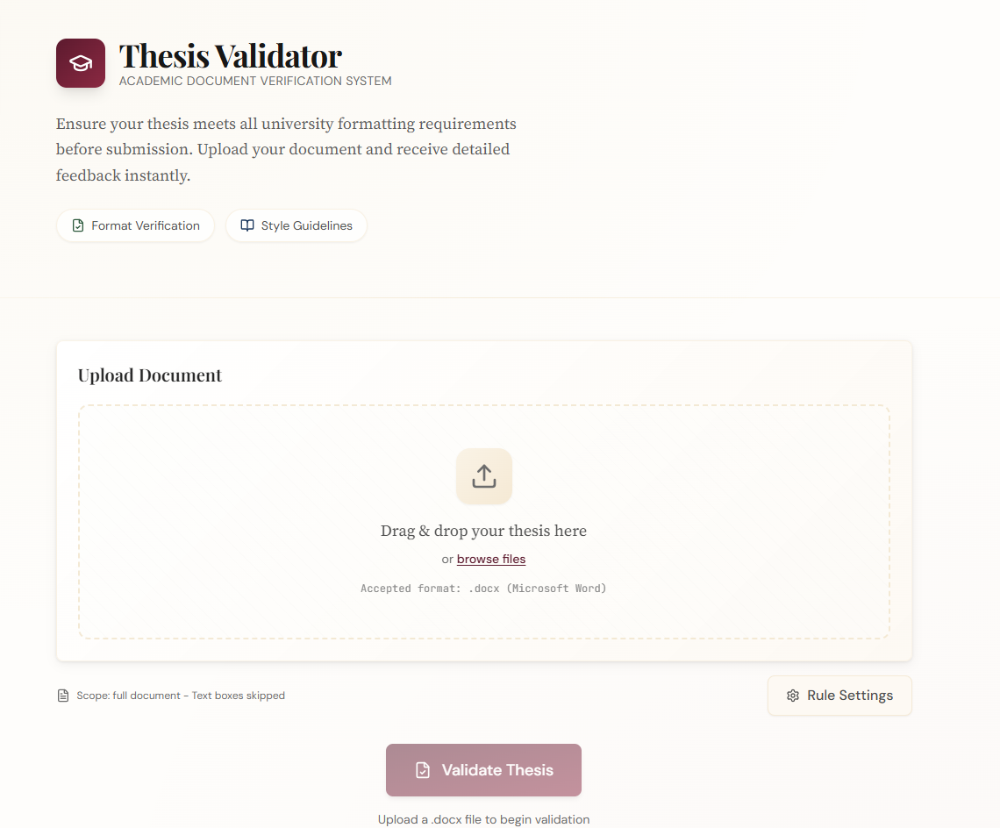
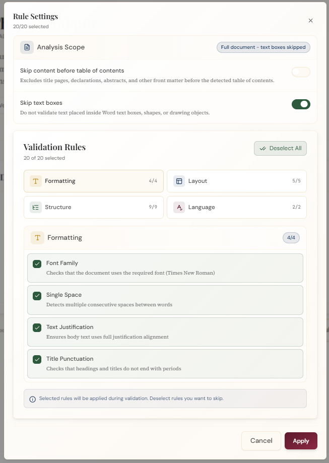
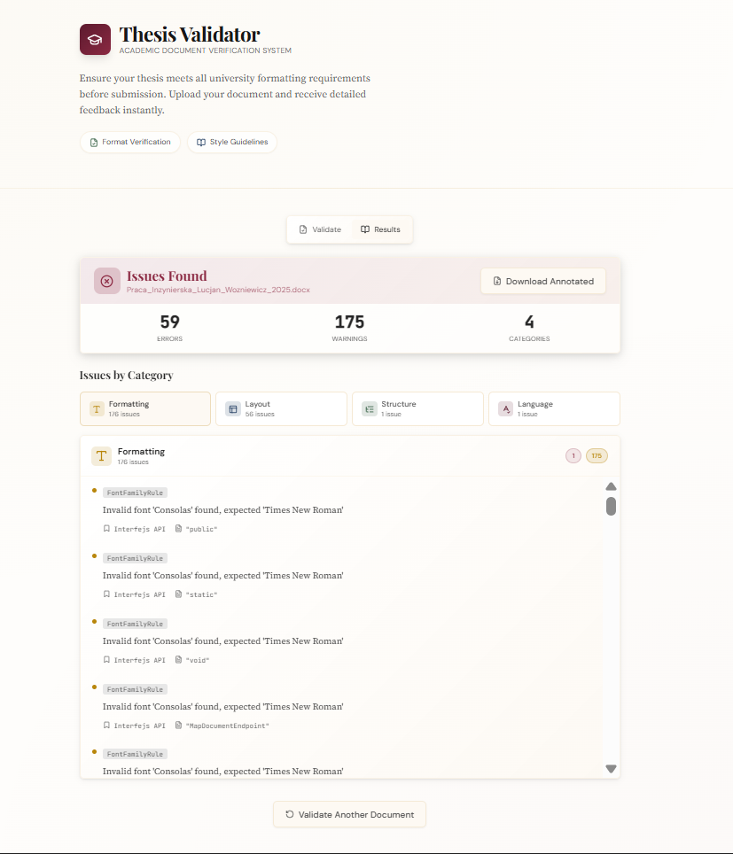

# Thesis Validator

A full-stack web app for validating `.docx` thesis documents against formatting, layout, structure, and grammar rules.

## Demo

Screenshots from the current app:







## Overview

Thesis Validator helps students check Word thesis documents before submission. Users upload a `.docx` file, choose validation rules, review grouped issues, and can download an annotated copy with comments placed in the document.

I built this project to practice a realistic full-stack workflow: document parsing, rule-based validation, API design, frontend state management, and automated backend testing. The app is useful for students who want a faster way to catch formatting and structure problems that are easy to miss during manual review.

## Features

- Upload and validate `.docx` thesis files from an Angular interface.
- Select validation rules by category before running a check.
- Validate formatting rules such as font family, single spaces, title punctuation, and text justification.
- Check layout and structure rules including paragraph spacing, indentation, heading depth, table of contents, empty sections, and figure captions.
- Run grammar checks through a local LanguageTool service.
- Skip front matter before the table of contents and skip Word text boxes when needed.
- View validation results grouped by category with error and warning counts.
- Download an annotated `.docx` file with comments marking detected issues.

## Tech Stack

- Frontend: Angular 18, TypeScript, RxJS, Tailwind CSS, lucide-angular
- Backend: ASP.NET Core 9, C#, Minimal APIs, Swagger/OpenAPI
- Database: None
- Auth: None
- Testing: xUnit, Moq, coverlet, Angular/Karma test setup
- Deployment: GitHub Actions CI for frontend build and backend build/tests
- Other: Docker Compose, LanguageTool, DocumentFormat.OpenXml, Postman collection

## Getting Started

### 1. Clone the repository

```bash
git clone https://github.com/void0xf/thesis-validator.git
cd thesis-validator
```

### 2. Install dependencies

Install the frontend packages:

```bash
cd src/frontend
npm ci
```

Restore the .NET solution from the repository root:

```bash
cd ../..
dotnet restore ThesisValidator.sln
```

### 3. Configure environment variables

The default local configuration works for basic development. The backend reads its local settings from `src/backend/appsettings.json` and `src/backend/appsettings.Development.json`.

Start the local grammar service before using grammar validation:

```bash
docker compose -f docker/docker-compose.yml up -d
```

### 4. Run the development servers

Start the backend API from the repository root:

```bash
dotnet run --project src/backend/ThesisValidator.Api.csproj --launch-profile http
```

In a second terminal, start the Angular frontend:

```bash
cd src/frontend
npm start
```

### 5. Open the app locally

- Frontend: `http://localhost:4200`
- Backend API: `http://localhost:5213`
- Swagger UI: `http://localhost:5213/swagger`
- LanguageTool service: `http://localhost:8010`

The Angular dev server proxies `/api` requests to `http://localhost:5213` through `src/frontend/proxy.conf.json`.

## Environment Variables

| Variable | Purpose | Required |
|---|---|---|
| `ASPNETCORE_ENVIRONMENT` | Sets the backend environment. The launch profile sets this to `Development` locally. | No |
| `LanguageTool__BaseUrl` | Overrides the LanguageTool service URL. Defaults to `http://localhost:8010`. | No |
| `Cors__AllowedOrigins__0` | Allows a frontend origin outside the default development origin. Defaults to `http://localhost:4200` in development. | No |

No secrets are required for basic local setup.

## Available Scripts

Frontend commands from `src/frontend/package.json`:

```bash
npm start
npm run build
npm run watch
npm test
```

Backend and solution commands:

```bash
dotnet restore ThesisValidator.sln
dotnet build src/backend/ThesisValidator.Api.csproj
dotnet test tests/backend.Tests/ThesisValidator.Api.Tests.csproj
dotnet run --project src/backend/ThesisValidator.Api.csproj --launch-profile http
```

Local service command:

```bash
docker compose -f docker/docker-compose.yml up -d
```

## Project Structure

```text
.
|-- .github/workflows/ci.yml
|-- docker/docker-compose.yml
|-- docs/screenshots/
|-- src/
|   |-- backend/
|   |   |-- Annotation/
|   |   |-- Application/Validation/
|   |   |-- DocumentProcessing/
|   |   |-- Endpoints/Documents/
|   |   |-- Infrastructure/LanguageTool/
|   |   |-- Rules/
|   |   |-- Program.cs
|   |   `-- ThesisValidator.Api.csproj
|   `-- frontend/
|       |-- src/app/components/
|       |-- src/app/models/
|       |-- src/app/services/
|       |-- proxy.conf.json
|       `-- package.json
|-- tests/backend.Tests/
|-- ThesisValidator.postman_collection.json
`-- ThesisValidator.sln
```

## Architecture / Implementation Notes

The backend uses ASP.NET Core Minimal APIs. Document routes are grouped under `/api/documents` and include endpoints for validation, annotated downloads, available rules, and health checks.

Validation is rule-based. Each rule implements the shared validation rule framework and is registered through dependency injection by scanning the backend assembly. Rules are grouped around formatting, layout, structure, and language checks.

Document processing uses `DocumentFormat.OpenXml` to inspect Word documents, extract text, resolve formatting, detect headings, analyze lists, detect figure captions, and apply comments to annotated output files.

Grammar validation calls a local LanguageTool service through an injected HTTP client. Docker Compose provides the service for local development.

The Angular frontend uses standalone components, signals, computed state, and a `ValidationService` for API calls. The main app state moves between upload, validating, and results views. Validation results are normalized on the client before rendering.

The repository includes backend tests with xUnit and fixture `.docx` files. GitHub Actions builds the Angular frontend and runs the backend build and tests on pushes and pull requests to `main`.

## What I Learned

- I learned how to design a rule-based validation pipeline that can grow without hard-coding every rule into the API layer.
- I practiced reading and annotating Word documents with OpenXML instead of treating uploaded files as plain text.
- I learned how to connect an Angular dev server to a local ASP.NET Core API through a proxy configuration.
- I practiced separating document parsing, validation rules, API responses, and frontend rendering into smaller pieces.
- I learned how to test document validation behavior with real `.docx` fixtures.

## Future Improvements

- Add more frontend unit tests around file upload, rule selection, and result rendering.
- Add end-to-end tests for the upload-to-annotated-download workflow.
- Improve accessibility for keyboard navigation, focus states, and screen reader labels.
- Add CI checks for frontend tests once the test suite is expanded.
- Add deployment configuration and replace the demo placeholder with a hosted link.
- Add clearer validation profiles for different university thesis requirements.
- Document how to add a new backend validation rule.

## License

> No license has been added yet.
